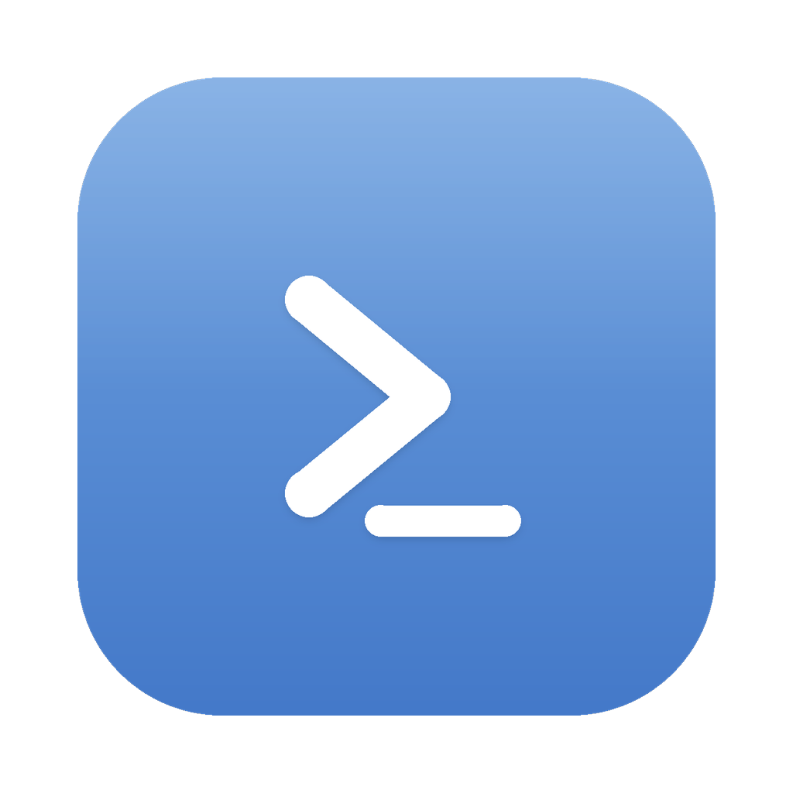

<p align="center">
  
</p>

<h1 align="center">Breeze</h1>

<p align="center"><b>The battery-efficient terminal for AI coding agents.</b></p>

Breeze is a native, no-GPU terminal emulator built for one job: running long-lived
AI coding-agent CLIs without melting your laptop. It understands that an agent sitting
at a prompt is *idle* — and stops paying for work that isn't happening.

## Why

A general-purpose terminal has no awareness of what runs inside it. When an agent CLI
spins a render loop at 60 FPS to animate a spinner over a static prompt, the terminal
doesn't care. When several idle sessions hold gigabytes of RAM, it doesn't notice. When
your Mac heats up on battery, it offers no help.

Breeze treats the program inside each pane as something to manage, not just draw.

## What it does

- **CPU-aware throttling.** A per-pane state machine (running tools / streaming / waiting /
  deep-idle) drives duty-cycled `SIGSTOP`/`SIGCONT` throttling, so an idle agent costs
  almost nothing while an active one runs at full speed.
- **Freezes background tabs.** A tab you can't see doesn't render and its process is
  suspended — 0% CPU until you return to it.
- **Child cleanup.** Stale helper processes spawned by the agent are reniced or reaped.
- **Memory alerts.** Watches resident size and flags a session that's leaking so you can
  restart it before it hurts.
- **No GPU, no animations.** CPU text rendering only — on Apple Silicon it rides the
  efficiency cores nearly for free. No Metal wake-ups, no blinking, no effects.
- **Tabs + splits.** A tiling workspace of panes with fast, keyboard-driven layout.

## Build

Requires a recent stable Rust toolchain.

```sh
cargo build --release
# binary: target/release/breeze
```

Run `target/release/breeze`, or copy it onto your `PATH`.

### macOS app bundle

To get a proper `Breeze.app` (with the app icon in the Dock/Finder):

```sh
./scripts/make-app.sh                 # builds ./Breeze.app
./scripts/make-app.sh /Applications   # …and installs it
```

## Workspace

A small Rust workspace:

- `breeze-vt` — terminal grid / VT parsing.
- `breeze-core` — platform-agnostic logic (session state, throttle policy, config, layout).
- `breeze-platform` — per-OS backends (process suspend/inspect, PTY, power).
- `breeze-ui` — the windowing/tabs/splits shell and CPU text renderer (the `breeze` binary).

## License

Breeze is free software, licensed under the **GNU General Public License v3.0 or later** (see [LICENSE](LICENSE)). Every fork or modified version must remain open source under the same terms — Breeze stays free, forever.

© 2026 Alden Bernstein.
